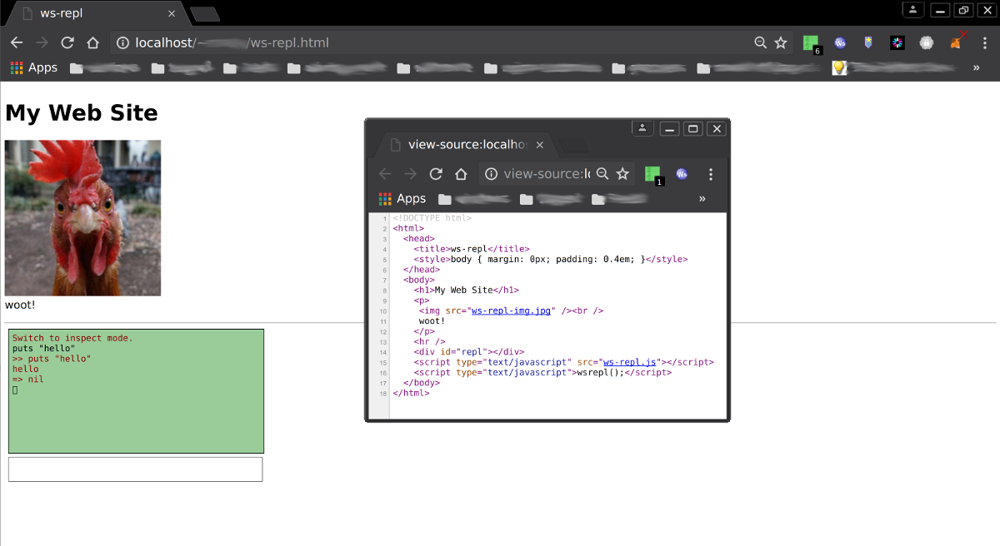
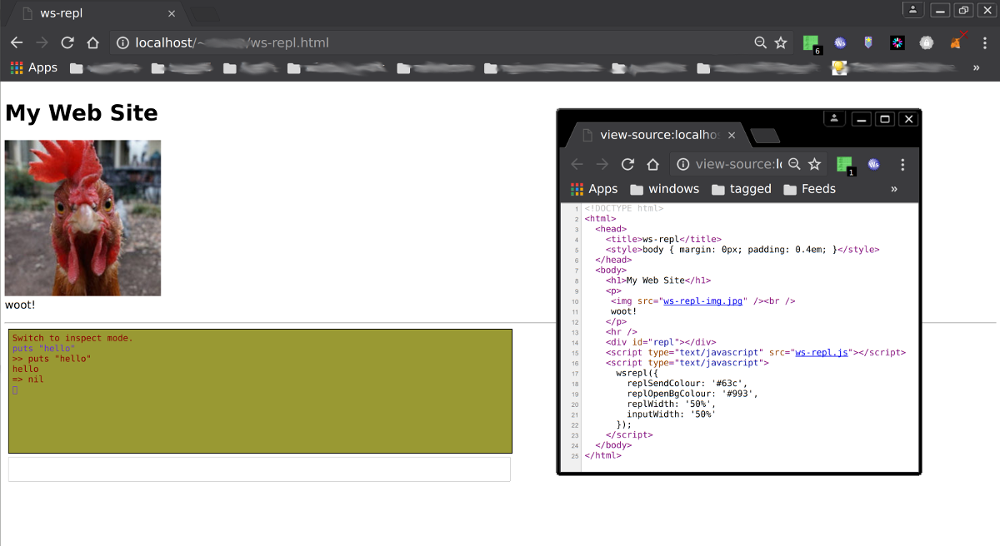

ws-repl
=======

Arbitrary REPL in a web-page using [websocketd](https://github.com/joewalnes/websocketd).

Quick Start
-----------

* [Get websocketd](https://github.com/joewalnes/websocketd/wiki/Download-and-install)
* Copy the ws-repl.html file into a browsable location
* Edit your web-server config to expose the websocket (use the provided nginx-config fragment as a guide)
* Run the backend process in websocketd (see the examples.sh file for inspiration)
* Browse to the page

Widget detail
-------------

The javascript can be used as a widget on arbitrary web-pages. Just place `<div id="repl"></div>` wherever you want it to appear.
It can be customised extensively (including changing the div's id from "repl") by passing parameters to the init function, for
example:

```
wsrepl({socketProto: 'wss', bufferLines=300, replBorderStyle: 'dashed'});
```

See `defArgs` in ws-repl.js to see what can be customised.

Notes
-----

* This just pipes STDIN/STDOUT from/to the browser, so any interactive process using things more complex than that, like ncurses,
  will of course not work.
* This presumes a relatively recent browser with the usual HTML5 capabilities, code has not been bloated to accomodate old
  browsers - that can easily be done with backwards-compat javascript shims.
* In the interests of simplicity this includes no security provisions, so if you use it in a public-facing web-page **BE SURE**
  to sandbox it if it does anything invasive or non-trivial, and/or include some form of password/token protection if you intend
  it for trusted users.
* Even then, if running anything more complex than a basic echo-server still think hard how much you trust your logged-in users
  to mess around with it.
* Lastly, don't run the backend websocketd as root. That would be profoundly silly.

Backend invocation examples
---------------------------

* picolisp REPL:

      `websocketd --address=127.0.0.1 --port=8080 pil`

* picolisp REPL (with sed to trim ': '):

      `websocketd --address=127.0.0.1 --port=8080 sh -c 'pil | sed -u -e "s/^: //"'`

* ruby REPL:

      `websocketd --address=127.0.0.1 --port=8080 irb`

* simple echo server:

      `websocketd --address=127.0.0.1 --port=8080 sh -c 'while IFS= read -r input; do printf "You said: %s\\n" "${input}"; done'`

* poor man's SSH if run over https with http-auth? (just kidding)

      `websocketd --address=127.0.0.1 --port=8080 sh -c 'sh 2>&1'`

Screenshots
-----------





Code
----

This can be found on [github](https://github.com/rowanthorpe/ws-repl). Report bugs either through the issue-tracker there or by
email to rowan at rowanthorpe dot com.
